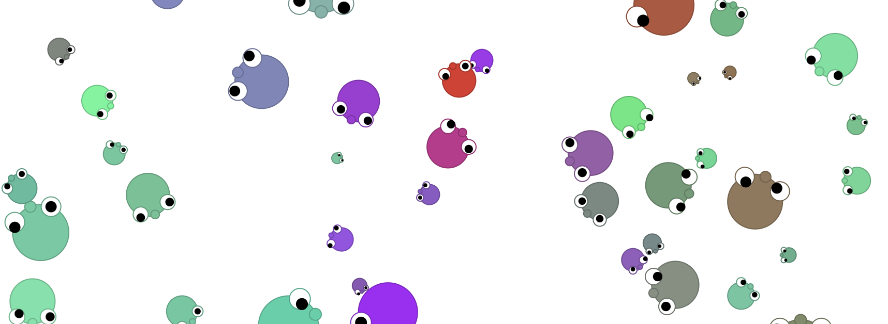

# [Dots](https://dots-54d68.firebaseapp.com/)



_
## What
このプロジェクトは、Vue.js の学習の為に作成しました。
Dotsは、見て、触れて、学んで、改造して楽しむアプリです。

[デモページ](https://dots-54d68.firebaseapp.com/)を別のウインドで開いて動きを試してみましょう。

## How to play
画面内の好きな場所をクリックすると、かわいいキャラクターが出現します。
このキャラクターがDotです。
Dotが進む方向、速さ、色、大きさはランダムです。

複数のDotを配置してみましょう。
Dot同士が衝突すると、互いに向きを変えます。
また、より新しいDotから古いDotへ色が少し伝搬します。


## Project setup
```
$ yarn install
```

### Compiles and hot-reloads for development
```
$ yarn serve
```
[http://localhost:8080/](http://localhost:8080/)


### Compiles and minifies for production
```
$ yarn build
```


## Details
Dotsは、学習用のJavaアプレットとして誕生しました(当時は別の名前でした)。

[こちら](https://qiita.com/yuneco/items/34daf063075d03c4eede)の記事を読み、DotsをVue.jsで実装してみたいという衝動に駆られました。
作者にとって初めてのVue.jsです。同記事をかなり参考にさせて貰いました。

Javaアプレット版のDotsは、円形の当たり判定(Dot同士の距離による当たり判定)を総当りでやっていました。
Vue.js版では、[box-intersect](https://github.com/mikolalysenko/box-intersect) を利用し、円形の当たり判定処理を間引いています。
ただし、box-intersect を利用することによるオーバーヘッドを検証していないので、効果は定かではありませんw


## Memo
### Given
* OS: macOS Big Sur
* Homebrew
  ```
  $ brew -v
  Homebrew 3.2.0
  Homebrew/homebrew-core (git revision a9027977ee; last commit 2021-06-25)
  ```

### Nodebrew setup
```
$ brew install nodebrew
$ nodebrew -v
nodebrew 1.1.0
```

### Node.js setup
```
$ mkdir -p ~/.nodebrew/src
$ nodebrew install-binary latest
$ nodebrew ls
$ nodebrew use v16.4.0
$ nodebrew setup
$ echo 'export PATH=$PATH:$HOME/.nodebrew/current/bin' >> ~/.zshrc
$ source ~/.zshrc

$node -v
v16.4.0

$ npm -v
7.18.1
```

### Yarn setup
```
$ npm install -g yarn
$ echo 'export PATH=$PATH:$HOME/.yarn/bin' >> ~/.zshrc
$ source ~/.zshrc

$ yarn -v
1.22.10
```

### Vue CLI setup
```
$ yarn global add @vue/cli
$ vue -V
@vue/cli 4.5.13
```

### Create Dots project
```
$ vue create dots

Vue CLI v4.5.13
? Please pick a preset:
  Default ([Vue 2] babel, eslint)
  Default (Vue 3) ([Vue 3] babel, eslint)
> Manually select features

? Please pick a preset: Manually select features
? Check the features needed for your project: Choose Vue version, Babel, CSS Pre-processors, Linter
? Choose a version of Vue.js that you want to start the project with 3.x
? Pick a CSS pre-processor (PostCSS, Autoprefixer and CSS Modules are supported by default): Sass/SCSS (with dart-sass)
? Pick a linter / formatter config: Standard
? Pick additional lint features: Lint on save
? Where do you prefer placing config for Babel, ESLint, etc.? In dedicated config files
? Save this as a preset for future projects? (y/N) y
```

### Add box-intersect
```
$ cd dots
$ yarn add box-intersect
```

### Firebase setup
```
$ yarn global add firebase-tools
$ firebase login
$ firebase init
 ◉ Hosting: Configure files for Firebase Hosting and (optionally) set up GitHub 
Action deploys
 ◉ Emulators: Set up local emulators for Firebase products

 === Hosting Setup

Your public directory is the folder (relative to your project directory) that
will contain Hosting assets to be uploaded with firebase deploy. If you
have a build process for your assets, use your build's output directory.

? What do you want to use as your public directory? dist
? Configure as a single-page app (rewrite all urls to /index.html)? Yes
? Set up automatic builds and deploys with GitHub? No
? File dist/index.html already exists. Overwrite? No

=== Emulators Setup
? Which Firebase emulators do you want to set up? Press Space to select emulator
s, then Enter to confirm your choices. 
 ◯ Authentication Emulator
 ◯ Functions Emulator
 ◯ Firestore Emulator
 ◯ Database Emulator
❯◉ Hosting Emulator
 ◯ Pub/Sub Emulator
 ◯ Storage Emulator

? Which port do you want to use for the hosting emulator? 5000
? Would you like to enable the Emulator UI? Yes
? Which port do you want to use for the Emulator UI (leave empty to use any avai
lable port)? 
? Would you like to download the emulators now? Yes
```

* Start emulator
  ```
  $ cd dots
  $ firebase emulators:start
  ```
  [http://localhost:5000/](http://localhost:5000/)

* Deploy
  ```
  $ cd dots
  $ firebase deploy
  ```

## 参考
* [VueとSVGを使ってシューティングゲーム『ネコ🐱メザシ🐟アタック🌟』を作ったのでソースと解説](https://qiita.com/yuneco/items/34daf063075d03c4eede)
* [Vue.jsの環境構築 (mac)](https://qiita.com/reflet/items/16f90cbb0db68fd6a498)
* [Macでyarnをインストールする方法](https://awesome-linus.com/2019/04/11/mac-yarn-install/)
* [VueアプリをFirebaseに爆速デプロイ!](https://qiita.com/kmtym1998/items/118090f83902371c3715)
 

